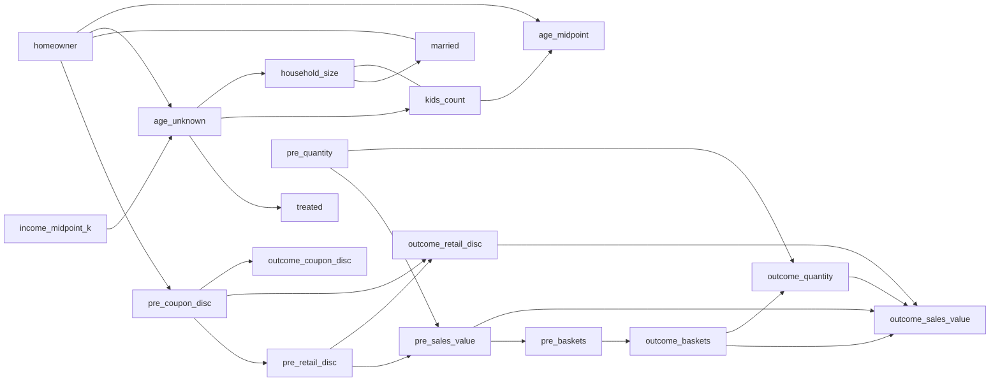

# 0. Introduction

本記事では、`causal-learn` を用いて POS データから因果グラフ構造を探索する。


## 0.1. 本記事の目的と想定読者

想定読者は、大学院レベルの数学または情報工学の基礎を持ち、Python によるデータ処理を自力で読める人である。具体的には、確率変数、条件付き独立性、相関・偏相関、行列計算、pandas による集計処理を概ね理解している読者を想定する。

記事の目的は、初めて因果探索を実装する読者が、理論面と実装面の両方を理解し、手元で同じ分析を再現できるようにすることである。単に `causal-learn` の API を呼び出すだけではなく、どのような仮定のもとで DAG 候補を出しているのか、実データをどの粒度に加工してからアルゴリズムへ渡すべきかを説明する。

この記事を読み終えると、少なくとも次の2点を説明・再現できる状態を目指す。

- PC アルゴリズムが何を仮定し、何を出力しているのか
- `causal-learn` に投入するために、実データをどう加工すればよいのか


## 0.2. 本記事での実施内容

本記事では以下を行う。

1. completejourney の parquet データを YAML 定義から読み込む
2. 世帯を観測単位として、キャンペーン前後の購買特徴量を作る
3. カテゴリ変数を PC アルゴリズムに渡せる数値変数へ変換する
4. `causal-learn` の PC アルゴリズムを実行する
5. 推定された CPDAG を Markdown, DOT, CSV として出力する
6. 出力されたグラフ構造の読み方と限界を整理する

実行は `uv` を前提にしている。

```bash
uv run python articles/094af72be38ab9/experiment/03_causal_discovery_completejourney.py
```

なお、本記事は「因果効果の大きさ」を直接推定する記事ではない。ここで推定するのは、変数間のグラフ構造である。処置効果、例えば `treated` が `outcome_sales_value` をどれだけ変化させるかを知りたい場合は、DoWhy や EconML を用いた識別・推定の段階に進む必要がある。

## 0.3. 因果探索と因果効果推定の違い

因果推論の実装では、少なくとも次の2つを分けて考える必要がある。

| 目的 | 問い | 代表的な手法・ライブラリ |
|---|---|---|
| 因果探索 | どの変数とどの変数が因果的に接続していそうか | PC, GES, LiNGAM, causal-learn |
| 因果効果推定 | 介入したら結果がどれだけ変わるか | 回帰調整, IPW, Double ML, DoWhy, EconML |

本記事で扱う PC アルゴリズムは前者である。出力は「辺があるか」「向きが決まるか」であり、影響の強さ、つまり effect size や ATE/CATE を返すものではない。

例えば、以下の辺が得られたとする。

```text
pre_sales_value -> outcome_sales_value
```

これは「キャンペーン前の購買金額とキャンペーン期間中の購買金額の間に、条件付き独立性では消えない接続がある」と読む。だが、`pre_sales_value` が 1 増えたときに `outcome_sales_value` がいくつ増えるかは、この結果だけでは分からない。

## 0.4. 使用データ: completejourney

扱うデータは completejourney である。世帯単位に購買履歴を集計し、キャンペーン対象かどうか、キャンペーン前の購買行動、キャンペーン期間中の購買行動、世帯属性の間にどのような依存構造が見えるかを PC アルゴリズムで推定する。

- [Git Hub](https://github.com/bradleyboehmke/completejourney/tree/master/data)

本記事では、事前に RData から parquet に変換した中間データを使う。データセット定義は次の YAML に置いている。

```text
workspace/shared/py/myproj/conf/dataset/completejourney/10_interim.yaml
```

今回の因果探索では、主に以下の4テーブルを用いる。

| テーブル | 用途 |
|---|---|
| `campaign_descriptions` | キャンペーンの開始日・終了日を取得する |
| `campaigns` | どの世帯がどのキャンペーン対象かを取得する |
| `demographics` | 世帯属性を取得する |
| `transactions` | 購買履歴を事前期間・結果期間に集計する |

# 1. 問題設定

本記事では、世帯ごとに「キャンペーン対象であること」と「キャンペーン期間中の購買行動」の周辺にある DAG 構造を探索する。より具体的には、世帯属性、キャンペーン前の購買行動、キャンペーン対象フラグ、キャンペーン期間中の購買行動の間に、条件付き独立性から見てどのような辺が残るかを調べる。

中心に置く問いは以下である。

```text
世帯属性・事前購買行動・キャンペーン対象・結果期間購買は、どのようなグラフ構造として観測されるか
```

ここで注意すべき点は、本記事の PC アルゴリズムは「キャンペーン効果の大きさ」を推定するものではないということである。探索するのは、`treated -> outcome_sales_value` のような辺が構造として残るか、また購買行動や世帯属性がどのように接続されるかである。

DAG 探索にあたり、本記事では次の仮定を置く。

- 観測単位は世帯である
- 世帯属性は、事前購買・キャンペーン対象・結果期間購買より時間的に先にある
- 事前購買は、キャンペーン対象および結果期間購買より時間的に先にある
- 結果期間購買から事前購買へは因果の向きを許さない
- 観測した変数集合で、主要な条件付き独立性構造をある程度表現できる
- `fisherz` を用いるため、数値化した変数に対して線形 Gaussian 近似を置く

この仮定のもとで、PC アルゴリズムに背景知識として時間順制約を与え、CPDAG を推定する。したがって、得られるグラフは「データから自動的に発見された真の DAG」ではなく、「上記の仮定と前処理のもとで条件付き独立性が示唆する DAG 候補」である。

因果探索では、まず何を1サンプルとみなすかを決める必要がある。本記事では観測単位を `household_id` とする。

つまり、トランザクション1行をそのままサンプルにするのではなく、各世帯についてキャンペーン前後の購買行動を集計し、世帯ごとの特徴量テーブルを作る。

## 1.1. 観測単位: household

最終的な分析データは以下の単位を持つ。

```text
1 row = 1 household
```

この設計により、以下の変数を同じ行に持てる。

- 世帯属性
- キャンペーン対象フラグ
- キャンペーン前の購買量
- キャンペーン期間中の購買量

トランザクション単位のままでは、世帯属性、キャンペーン割当、購買行動の時間関係を同じ粒度で扱いにくい。因果探索に投入する前に、対象とする介入・結果に合わせて観測単位を揃える必要がある。

## 1.2. 使用テーブル

本記事で使用するテーブルは以下である。

```python
entries = (
    "campaign_descriptions",
    "campaigns",
    "demographics",
    "transactions",
)
```

`products`, `coupons`, `promotions` もデータセットには存在するが、今回の最初の実装では使わない。商品カテゴリやクーポン種別まで入れると変数数が急増し、PC アルゴリズムの条件付き独立性検定が不安定になりやすい。初回実装では、狭い変数集合から始めるほうがよい。

## 1.3. 変数定義

作成する主な変数は以下である。

| 変数 | 意味 |
|---|---|
| `treated` | 対象キャンペーンに割り当てられた世帯なら 1 |
| `pre_baskets` | 事前期間の購買バスケット数 |
| `pre_quantity` | 事前期間の購入数量 |
| `pre_sales_value` | 事前期間の購買金額 |
| `pre_retail_disc` | 事前期間の小売値引き額 |
| `pre_coupon_disc` | 事前期間のクーポン値引き額 |
| `outcome_baskets` | 結果期間の購買バスケット数 |
| `outcome_quantity` | 結果期間の購入数量 |
| `outcome_sales_value` | 結果期間の購買金額 |
| `outcome_retail_disc` | 結果期間の小売値引き額 |
| `outcome_coupon_disc` | 結果期間のクーポン値引き額 |
| `age_midpoint` | 年齢カテゴリを代表値に変換した値 |
| `income_midpoint_k` | 所得カテゴリを代表値に変換した値 |
| `homeowner` | 持ち家なら 1 |
| `married` | 既婚なら 1 |
| `household_size` | 世帯人数 |
| `kids_count` | 子供の人数 |

これらは「真の因果変数」そのものではなく、データから構成した特徴量である。例えば `age_midpoint` は年齢カテゴリの代表値であり、厳密な年齢ではない。

## 1.4. 時間窓: pre期間 / campaign期間 / outcome期間

今回の実装では `campaign_id=18` をデフォルトにしている。

```python
DEFAULT_CAMPAIGN_ID = "18"
```

キャンペーン開始週より前の `pre_weeks=8` 週間を事前期間とし、キャンペーン実施期間を結果期間とする。

```text
campaign_id: 18
pre_weeks: 36-43
outcome_weeks: 44-52
```

この時間順は、後で背景知識として PC アルゴリズムに渡す。

```text
世帯属性 -> 事前購買 -> キャンペーン対象 -> 結果期間購買
```

PC アルゴリズムだけでは、時間的にありえない向きが出る場合がある。そこで、背景知識として「未来から過去への矢印」を禁止する。

# 2. 理論

ここでは、実装に必要な範囲で PC アルゴリズムの理論を整理する。

## 2.1. DAG, CPDAG, Markov equivalence class

因果グラフでは、変数をノード、因果関係を有向辺で表す。

```text
X -> Y
```

閉路を持たない有向グラフを DAG, Directed Acyclic Graph と呼ぶ。因果推論では、多くの場合 DAG を仮定して議論する。

ただし、観測データから常に完全な DAG が識別できるわけではない。複数の DAG が同じ条件付き独立性構造を持つことがある。このような DAG の集合を Markov equivalence class と呼ぶ。

PC アルゴリズムの出力は、一般に一意の DAG ではなく CPDAG, Completed Partially Directed Acyclic Graph である。CPDAG では、向きが識別できる辺は有向辺として、向きが決まらない辺は無向辺として表される。

したがって、出力に以下のような辺があった場合、これは「隣接しているが、向きはデータと仮定からは決まらなかった」と読む。

```text
homeowner --- married
```

## 2.2. 条件付き独立性

PC アルゴリズムは、条件付き独立性検定を繰り返すことでグラフ構造を推定する。

変数 `X` と `Y` が、変数集合 `S` で条件付けたときに独立であることを以下のように書く。

```text
X independent of Y | S
```

PC アルゴリズムでは、まず完全グラフから始める。そして、ある条件集合 `S` に対して `X` と `Y` が条件付き独立だと判断されれば、`X` と `Y` の辺を削除する。

この削除操作を条件集合のサイズを増やしながら繰り返すことで、グラフの skeleton, つまり辺の有無を推定する。

## 2.3. PCアルゴリズム

PC アルゴリズムは大きく以下の手順からなる。

1. 全変数間に辺がある完全無向グラフから開始する
2. 条件付き独立性検定により、不要な辺を削除する
3. unshielded collider を検出する
4. Meek rules などを用いて向きを伝播させる
5. CPDAG を出力する

unshielded collider とは、以下のような構造である。

```text
X -> Z <- Y
```

ここで `X` と `Y` は隣接していない。このような構造は条件付き独立性のパターンから向きを識別できる場合がある。

## 2.4. Fisher's Z検定

本記事では `causal-learn` の `fisherz` を使う。

```python
from causallearn.search.ConstraintBased.PC import pc
from causallearn.utils.cit import fisherz
```

Fisher's Z 検定は、連続変数が多変量正規分布に従うという近似のもとで、偏相関が 0 かどうかを検定する。

`X` と `Y` の偏相関を `rho_{XY.S}` とすると、帰無仮説は次である。

```text
H0: rho_{XY.S} = 0
```

ここで重要なのは、Fisher's Z 検定は本質的には連続・線形・Gaussian な仮定に近いことである。本記事のデータには二値変数や順序カテゴリを数値化した変数が含まれる。したがって、結果は探索的に読むべきである。

## 2.5. 背景知識による向き制約

因果探索において、データだけから向きを決めるのは難しい。だが、時間順に反する向きは事前知識として禁止できる。

本記事では以下の tier を設定する。

```text
tier 0: 世帯属性
tier 1: 事前購買
tier 2: treated
tier 3: 結果期間購買
```

この制約により、例えば `outcome_sales_value -> pre_sales_value` のような未来から過去への向きは禁止される。

背景知識は強力だが、使い方を誤ると結論を人間が事前に押し込むことになる。特に「この変数は原因であるはず」という希望を入れるのではなく、「この向きは時間的に不可能」という制約を入れるのが安全である。

## 2.6. PCで分かること・分からないこと

PC で分かることは以下である。

- 変数間に辺が残るか
- 一部の辺の向きが識別されるか
- 条件付き独立性から見たグラフ構造

PC だけでは分からないことは以下である。

- 因果効果の大きさ
- ATE
- CATE
- 介入した場合の反実仮想結果
- 未観測交絡がある場合の真の構造

したがって、本記事の結果は「因果効果推定の前段階」として扱うのがよい。

# 3. 実装

ここから実装を説明する。対象コードは以下である。

```text
workspace/articles/094af72be38ab9/experiment/03_causal_discovery_completejourney.py
```

## 3.1. 環境構築

依存関係は `pyproject.toml` に記載している。

```toml
[project]
requires-python = ">=3.13"
dependencies = [
    "causal-learn>=0.1.4.5",
    "pandas>=3.0.2",
    "pyarrow>=24.0.0",
    "pyyaml>=6.0.3",
]
```

実行は以下で行う。

```bash
uv run python articles/094af72be38ab9/experiment/03_causal_discovery_completejourney.py
```

## 3.2. YAMLによるデータ定義

データの物理パスをコードに直書きしないため、YAML で定義する。

```python
DATASET_YAML = Path("shared/py/myproj/conf/dataset/completejourney/10_interim.yaml")
```

YAML は以下のような構造を持つ。

```yaml
default:
    file:
        path: "{path_sys_base}/shared/data/10_interim/completejourney"
        name: ""
        type: "parquet"

transactions:
    file:
        name: "transactions.parquet"
```

`{path_sys_base}` はプロジェクトルートに置換される。これにより、ローカル環境や CI 環境でパスが変わっても、コード側は同じ論理名でデータを読める。

## 3.3. parquetの読み込み

読み込み処理では、YAML を解決して `FileConfigRegistry` に渡す。

```python
def load_completejourney_tables(
    *,
    project_root: Path,
    dataset_yaml: Path,
) -> dict[str, pd.DataFrame]:
    dataset_definition = load_dataset_definition(dataset_yaml, project_root)
    registry = FileConfigRegistry.from_mapping(dataset_definition)
    file_io = FileIOUtils(logger)

    return {
        entry: file_io.read_file(registry.read_config(entry), use_dask=False)
        for entry in (
            "campaign_descriptions",
            "campaigns",
            "demographics",
            "transactions",
        )
    }
```

## 3.4. household単位の分析データ作成

トランザクションデータは購買明細単位である。そのまま PC に渡すのではなく、世帯単位に集計する。

```python
aggregated = window.groupby("household_id", observed=True).agg(
    baskets=("basket_id", "nunique"),
    quantity=("quantity", "sum"),
    sales_value=("sales_value", "sum"),
    retail_disc=("retail_disc", "sum"),
    coupon_disc=("coupon_disc", "sum"),
    coupon_match_disc=("coupon_match_disc", "sum"),
)
```

この処理を事前期間と結果期間の両方に対して行う。

```python
pre = aggregate_transactions(..., prefix="pre")
outcome = aggregate_transactions(..., prefix="outcome")
```

購買が存在しない世帯の集計値は 0 とみなす。

```python
frame[transaction_columns] = frame[transaction_columns].fillna(0.0)
```

## 3.5. カテゴリ変数の数値化

PC の `fisherz` は数値行列を入力に取る。そのため、カテゴリ変数を数値に変換する必要がある。

年齢カテゴリは代表値に変換する。

```python
AGE_ORDER = {
    "19-24": 21.5,
    "25-34": 29.5,
    "35-44": 39.5,
    "45-54": 49.5,
    "55-64": 59.5,
    "65+": 70.0,
}
```

持ち家や既婚は二値変数にする。

```python
"homeowner": model_frame["home_ownership"].astype("string").eq("Homeowner").astype(float)
"married": model_frame["marital_status"].astype("string").eq("Married").astype(float)
```

この変換は近似である。特にカテゴリ変数を連続値のように扱うため、Fisher's Z 検定の前提からは外れる部分がある。記事の結果はこの制約を踏まえて読む必要がある。

## 3.6. 標準化と多重共線性除去

PC の Fisher's Z 検定では相関行列を使う。完全またはほぼ完全な線形従属があると、相関行列が特異になり検定が失敗する。

そこで、定数列を落とし、高相関な列を除去してから標準化する。

```python
def standardize(
    frame: pd.DataFrame,
    *,
    collinearity_threshold: float,
) -> pd.DataFrame:
    standardized = frame.copy()
    std = standardized.std(axis=0)
    non_constant = std[std > 0].index
    standardized = standardized.loc[:, non_constant]
    standardized = drop_collinear_columns(
        standardized,
        threshold=collinearity_threshold,
    )
    return (standardized - standardized.mean(axis=0)) / standardized.std(axis=0)
```

デフォルトでは、絶対相関が `0.995` 以上の列を片方落とす。

```python
parser.add_argument("--collinearity-threshold", type=float, default=0.995)
```

これは数値計算上の安定化であり、理論的な因果仮定ではない。どの列が落ちるかによって結果が変わりうるため、実務では感度分析が必要である。

## 3.7. causal-learnでPCを実行

PC アルゴリズムの実行部分は以下である。

```python
from causallearn.search.ConstraintBased.PC import pc
from causallearn.utils.cit import fisherz

cg = pc(
    frame.to_numpy(),
    alpha=alpha,
    indep_test=fisherz,
    stable=True,
    background_knowledge=background_knowledge,
    node_names=node_names,
    show_progress=False,
)
```

`alpha` は条件付き独立性検定の有意水準である。

```python
parser.add_argument("--alpha", type=float, default=0.01)
```

`alpha` を大きくすると、独立でないと判断しやすくなり、辺が残りやすくなる。逆に `alpha` を小さくすると、辺は少なくなりやすい。

## 3.8. グラフと辺リストの出力

実行結果は以下のディレクトリに出力する。

```text
workspace/articles/094af72be38ab9/experiment/causal_discovery/
```

出力ファイルは以下である。

| ファイル | 用途 |
|---|---|
| `causal_discovery_input.csv` | PC に投入した分析データ |
| `pc_edges.csv` | 推定された辺リスト |
| `pc_graph.dot` | Graphviz DOT 形式のグラフ |
| `pc_graph.md` | Mermaid 図と辺一覧を含むレポート |

グラフ構造を人間が読むなら、まず `pc_graph.md` を見るのがよい。

# 4. 結果

実行すると以下のようなログが得られる。

```text
samples: 2,469
variables: 18
edges: 25
output_dir: .../articles/094af72be38ab9/experiment/causal_discovery
```

PC に投入したサンプル数は 2,469 世帯、変数数は 18、推定された辺数は 25 である。

## 4.1. 入力データの概要

入力データは `causal_discovery_input.csv` に保存される。

```text
articles/094af72be38ab9/experiment/causal_discovery/causal_discovery_input.csv
```

このファイルは、最終的に PC アルゴリズムへ投入した世帯単位データである。記事の結果を検証したい場合、まずこの CSV の列を確認するとよい。

## 4.2. 推定されたグラフ構造

グラフ構造は `pc_graph.md` に出力される。

```text
articles/094af72be38ab9/experiment/causal_discovery/pc_graph.md
```

Mermaid 図として以下のような構造が得られる。



## 4.3. 主要な辺の解釈

購買行動に関しては、以下の辺が自然である。

```text
pre_sales_value -> outcome_sales_value
pre_baskets -> outcome_baskets
pre_quantity -> outcome_quantity
```

これは、キャンペーン前によく購入していた世帯は、キャンペーン期間中にも購入しやすいという構造を表している。

また、結果期間内の購買指標同士にも辺が出ている。

```text
outcome_baskets -> outcome_quantity
outcome_quantity -> outcome_sales_value
outcome_retail_disc -> outcome_sales_value
```

これは同じ期間内で定義された集計変数同士なので、因果というより、測定上・定義上の近い関係が出ている可能性が高い。例えば購入数量と購買金額は、当然強く関連する。

このような辺は「構造として出た」ことと「介入可能な因果関係である」ことを分けて読む必要がある。

## 4.4. treatedとoutcomeの関係

今回の設定では、`treated -> outcome_sales_value` の直接辺は検出されなかった。

これは、キャンペーン対象が購買金額に効果を持たないことを意味するわけではない。PC アルゴリズムの結果として、他の変数で条件付けると `treated` と `outcome_sales_value` の直接接続が残らなかった、という意味である。

原因としては、少なくとも以下が考えられる。

- キャンペーン対象割当がランダムではなく、既存の購買傾向に強く依存している
- `treated` の効果が平均的には小さい
- 効果が特定セグメントにだけ存在し、線形 Gaussian 近似の PC では拾いにくい
- 結果期間の購買指標が事前購買指標でかなり説明される
- `fisherz` の仮定がデータに合っていない

したがって、`treated` の効果を知りたいなら、次の段階として DoWhy や EconML で効果推定を行う必要がある。

## 4.5. 結果の限界

今回の結果には以下の限界がある。

第一に、Fisher's Z 検定は連続・線形・Gaussian な仮定に依存する。今回の入力には二値変数や順序カテゴリを数値化した変数が含まれているため、検定の前提は厳密には満たされていない。

第二に、未観測交絡を扱えていない。例えば、世帯の嗜好、店舗への距離、競合店の利用、季節要因などはデータに入っていない。

第三に、変数設計に結果が依存する。特に、結果期間内の集計変数同士は定義上強く結びつくため、因果関係というより測定構造を拾っている可能性がある。

第四に、背景知識が結果に影響する。時間順の制約は妥当だが、制約の入れ方によって矢印の向きは変わる。

以上から、今回の PC 結果は「確定した因果モデル」ではなく、「次に検証すべき DAG 候補」として使うのが適切である。

# 5. 発展

## 5.1. DoWhyでDAGを検証する

PC で得たグラフは、そのまま最終結論にするのではなく、人間のドメイン知識で修正したうえで DoWhy に渡すとよい。

DoWhy では、以下の流れで分析できる。

```text
model
identify
estimate
refute
```

PC は構造候補を出すが、その構造に基づいて処置効果が識別可能かは別問題である。DoWhy を使えば、backdoor adjustment set が存在するか、placebo test や subset refuter で推定結果がどれくらい頑健かを確認できる。

## 5.2. EconMLでATE/CATEを推定する

効果の大きさを知りたい場合は EconML が有用である。

例えば、`treated` を処置、`outcome_sales_value` を結果、世帯属性と事前購買行動を共変量として、Double ML や Causal Forest を使う。

このとき推定対象は以下である。

```text
ATE = E[Y(1) - Y(0)]
CATE(x) = E[Y(1) - Y(0) | X = x]
```

PC はこの値を返さない。PC が返すのは、効果推定に使う DAG 候補である。

## 5.3. GES / LiNGAM / NOTEARSとの比較

因果探索には PC 以外の方法もある。

| 手法 | 特徴 |
|---|---|
| PC | 条件付き独立性検定ベース |
| GES | スコアベース |
| LiNGAM | 非 Gaussian 性を用いる |
| NOTEARS | 連続最適化として DAG を推定する |

実務では、単一の因果探索手法の結果を盲信しないほうがよい。複数手法で安定して出る辺と、手法ごとに変わる辺を比較することで、どの構造が頑健かを確認できる。

# R. 参考資料

## R.1. 対応リポジトリ

### R.1.1. 因果探索用ソースコード

**注!: 以下のソースコード単体では動かず、共通機能の import が必要である**

- [workspace/articles/094af72be38ab9/experiment/](https://github.com/kousuke-ota-datascience/0015_zenn/tree/main/workspace/articles/094af72be38ab9/experiment)
    - [03_causal_discovery_completejourney.py](https://github.com/kousuke-ota-datascience/0015_zenn/blob/main/workspace/articles/094af72be38ab9/experiment/03_causal_discovery_completejourney.py)

### R.1.2. 共通機能

- [workspace/shared/py/myproj/src/myproj](https://github.com/kousuke-ota-datascience/0015_zenn/tree/main/workspace/shared/py/myproj/src/myproj)

### R.1.3. データセット定義

- [workspace/shared/py/myproj/conf/dataset/completejourney](https://github.com/kousuke-ota-datascience/0015_zenn/tree/main/workspace/shared/py/myproj/conf/dataset/completejourney)
    - [10_interim.yaml](https://github.com/kousuke-ota-datascience/0015_zenn/blob/main/workspace/shared/py/myproj/conf/dataset/completejourney/10_interim.yaml)

## R.2. 理論・ライブラリ

- [causal-learn documentation](https://causal-learn.readthedocs.io/)
- [causal-learn GitHub](https://github.com/py-why/causal-learn)
- [DoWhy documentation](https://www.pywhy.org/dowhy/)
- [EconML documentation](https://econml.azurewebsites.net/)
