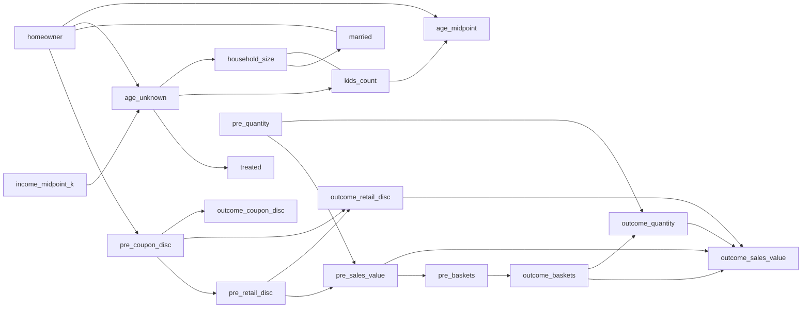

# causal-learn PC Causal Discovery

- campaign_id: `18`
- pre_weeks: `8`
- alpha: `0.01`
- collinearity_threshold: `0.995`
- background_knowledge: `True`
- samples: `2469`
- variables: `18`
- edges: `25`

## Graph

## Edges

| source | target | endpoint_source | endpoint_target | edge |
| --- | --- | --- | --- | --- |
| age_unknown | household_size | tail | arrow | --> |
| age_unknown | kids_count | tail | arrow | --> |
| age_unknown | treated | tail | arrow | --> |
| homeowner | age_midpoint | tail | arrow | --> |
| homeowner | age_unknown | tail | arrow | --> |
| homeowner | married | tail | tail | --- |
| homeowner | pre_coupon_disc | tail | arrow | --> |
| household_size | kids_count | tail | tail | --- |
| household_size | married | tail | arrow | --> |
| income_midpoint_k | age_unknown | tail | arrow | --> |
| kids_count | age_midpoint | tail | arrow | --> |
| outcome_baskets | outcome_quantity | tail | arrow | --> |
| outcome_baskets | outcome_sales_value | tail | arrow | --> |
| outcome_quantity | outcome_sales_value | tail | arrow | --> |
| outcome_retail_disc | outcome_sales_value | tail | arrow | --> |
| pre_baskets | outcome_baskets | tail | arrow | --> |
| pre_coupon_disc | outcome_coupon_disc | tail | arrow | --> |
| pre_coupon_disc | outcome_retail_disc | tail | arrow | --> |
| pre_coupon_disc | pre_retail_disc | tail | arrow | --> |
| pre_quantity | outcome_quantity | tail | arrow | --> |
| pre_quantity | pre_sales_value | tail | arrow | --> |
| pre_retail_disc | outcome_retail_disc | tail | arrow | --> |
| pre_retail_disc | pre_sales_value | tail | arrow | --> |
| pre_sales_value | outcome_sales_value | tail | arrow | --> |
| pre_sales_value | pre_baskets | tail | arrow | --> |

## Interpretation

- PC は条件付き独立性から CPDAG を推定する。矢印がない辺は、データと仮定だけでは向きが決まっていない。
- `fisherz` は連続・線形 Gaussian 近似の検定なので、二値変数や順序化したカテゴリを含む今回の結果は探索的に読む。
- `background_knowledge=True` では、世帯属性 -> 事前購買 -> キャンペーン対象 -> 結果期間購買、という時間順に反する向きを禁止している。