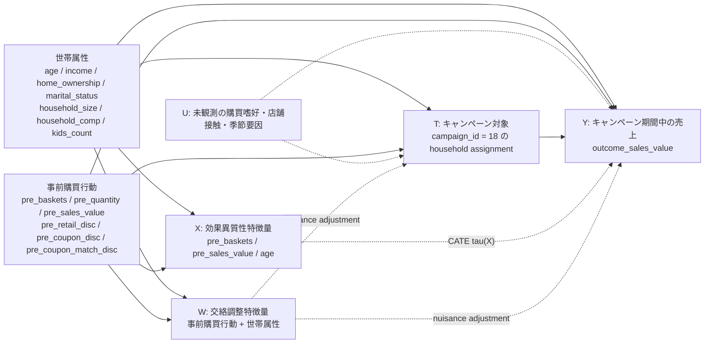

# Complete Journey EconML Model DAG



## Model Mapping

- `T`: `campaigns` に `campaign_id == "18"` で出現する世帯を 1、それ以外を 0。
- `Y`: campaign 18 の実施週 `44-52` における世帯別 `sales_value` 合計。
- `W`: DML の交絡調整に使う特徴量。アウトカム期間の変数は除き、事前購買行動と demographics を使う。
- `X`: CATE の異質性を見る特徴量。現在の実装では `pre_baskets`, `pre_sales_value`, `age`。
- `U`: データに入っていない要因。DAG に入れることで「観測変数で十分に調整できる」という仮定の強さを明示している。

## Identification Assumption

この推定はランダム化実験ではない。したがって、

```text
Y(1), Y(0) independent of T | W
```

つまり「事前購買行動と世帯属性で調整すれば、キャンペーン対象割当は条件付きで無作為に近い」という仮定に依存する。
